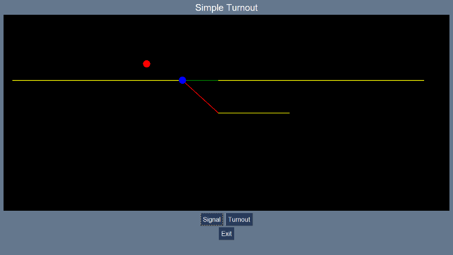

# LayoutControlLite
LayoutControlLite is a Python 3 library to enable the creation of schematic railway layouts with
a mimimum of coding.

The main aims of this project is to enable the deveoppment of layout control panels by people
with little experience of writing programms and to run on inexpensive hardware.

This example is produced by a short Python program



```python
from LayoutControlLite import Track, Stub, Turnout, Signal, Layout

# Define the individual items
main = Track('Main Line', (25, 200), (1175, 200))
turnout = Turnout('Turnout', (500, 200))
siding = Stub('Siding', (600, 150), (800, 150))
signal = Signal('Signal', (400, 225))

# Create the layout and add the items
layout = Layout('Simple Turnout')
layout.add(main)
layout.add(signal)
layout.add(turnout)
layout.add(siding)

# Run the layout with all defaults
layout.run()
```